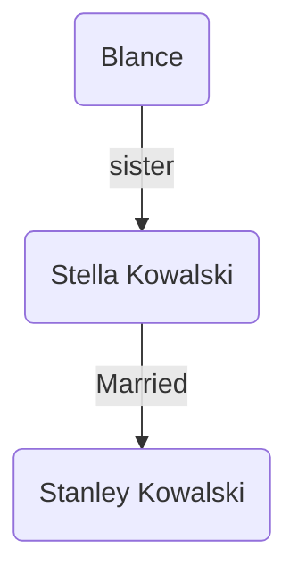

Play by Tennessee Williams
Dec 3rd 1947

## Characters

### Blanche DeBois
Protagonist
was from a well off family
30s, no money
lost ancestral house

### Stella
Blanche's sister

### Stanley
Stella's husband
Blanche  thinks of him as 

### Eunice
Neighbour

### Mitch
Neighbour
Mannerly

## Plot
Blanche takes a leave from her job citing nerves (neurasthenia??) 
Goes to her sister's place. She disapproves of her sister and her husband, and their living condition. 

