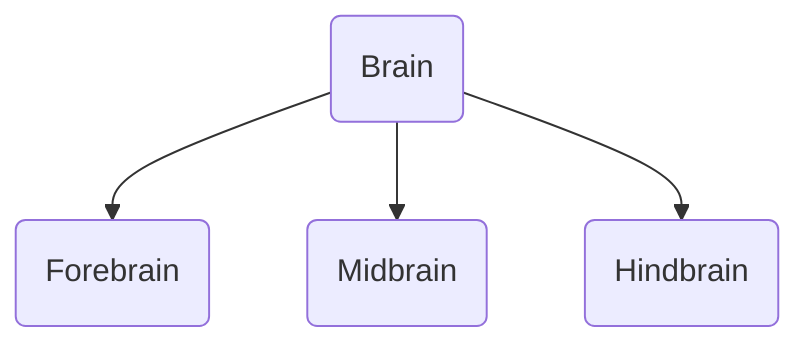

---
aliases:
  - brain
tags:
  - psychology
  - science
  - biology
---

# Brain
Collection of nerves 
60% fat
rest = water, salts, carbohydrates

## Hemispheres of the brain

## Sections of the brain

[[Forebrain]]
[[Midbrain]]
[[Hindbrain]]

## Parts of the Brain

[[Frontal Lobe]]
[[Cerebral Cortex]]
[[Central Sulcus]]
[[Parietal Lobe]]
[[Thalamus]]
[[Hypothalamus]]
[[Occipital Lobe]]
[[Cerebellum]]
[[Medulla Oblongata]]
[[Pons]]
[[Temporal Lobe]]
[[lateral ventrices]]
[[corpus callosum]]