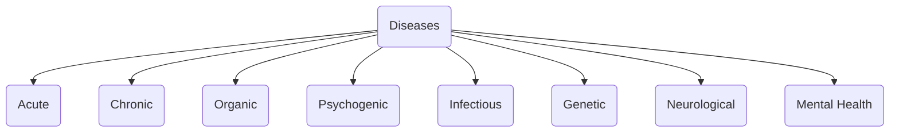
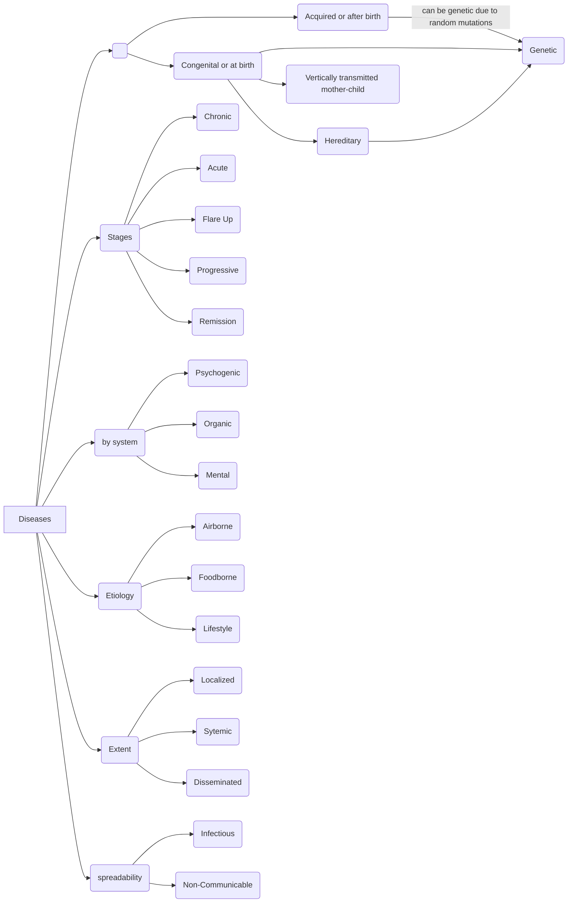

mnemonic: A COP 
## Acute Diseases
sudden onset, relatively short duration
usually severe but resolves quickly with appropriate treatment

eg. common cold, flu, gastroenteritis 

## Chronic Diseases
long duration
develop gradually
requires ongoing treatment
significantly impacts life 

eg. diabetes, hypertension, COPD, rheumatoid arthritis

## Organic Diseases
structural or functional abnormalities 
often from physical changes in the affected area

eg. coronary artery disease, liver cirrhosis

## Psychogenic Disorders
[[somatoform]]
[[conversion disorder]]

## Infectious Diseases
pathogens, external 
virus, bacteria, fungi, etc

## Genetic Diseases
can be mutations or from birth

## Neurological Diseases
diseases that affect the nervous system
brain, spinal cord, peripheral

## Mental Health Disorders

##

By acquirability
Congenital
Acquired 

anatomical 

topographical 

time

extent

 