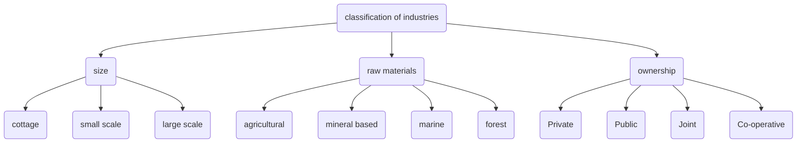
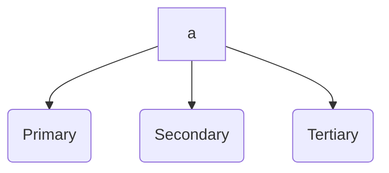

```mermaid
flowchart
a-->a1(size)
a-->a2(raw materials)
a-->a3(ownership)
a(classification of industries)

a1-->a11(cottage)
a1-->a12(small scale)
a1-->a13(large scale)

a2-->a21(agricultural)
a2-->a22(mineral based)
a2-->a23(marine)
a2-->a24(forest)

a3-->a31(Private)
a3-->a32(Public)
a3-->a33(Joint)
a3-->a34(Co-operative)
```

```mermaid
flowchart
a-->b(Primary)
a-->c(Secondary)
a-->d(Tertiary)
```
