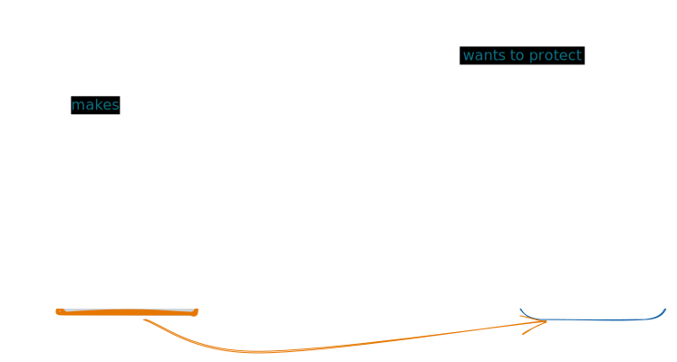

# Information Security

**Confidentiality** - only accessible to authorized parties
restricting access
(both transit and storage)

**Integrity** - makes sure data isn't altered or manipulated 
how data is stored, processed, and retrieved 

**Authenticity** - authorized source or not; verification of authority, 
non-repudiation - inability to deny or challenge acce 

**Availability** - Accessible and usable; 

**Vulnerability** - flaws, weaknesses, 
bugs, firmware issues,
weak passwords, any asset/resource
anything that **can be exploited**
eg. weak password

**Threat** - **potential security violation**; 
anything that could **exploit a vulnerability**
can cause a breach, 
if carried out, it is **an attack**
eg. armed robber

**Risk** - **_possibility_** of loss or harm
threat level and number of vulnerabilities 
potential for loss or damage
risk = probability x impact
financial or data loss, a damaged reputation or legal consequences

> mnemonic: CIA R on an ATV 
> 

## Security Mechanisms
Countermeasures are typically described in terms of security mechanisms, which are components comprising a defensive framework that protects IT resources, information, and services
## Security Policies
establishes a **set of security rules and regulations**
define how the rules are enforced
### Security Controls
steps and measures taken to prevent or respond to security threats / reduce avoid or risk 
##

**_Vulnerability x Threat_** _=_ **_Risk_**

---
see also : [[Hashing]] , salting, cryptography, 2fa, security by obscurity, pgp key, brute force, dictionary attack, privacy, DRM, social engineering, DDoS, SSL, [[Encryption]]

example (?? check)

vulnerability - no ssl certificate; no https
threat - pharming, redirects, phishing
risk - value of contents lost 

# Threat Agent
threat agent is an entity that poses a threat because it is capable of carrying out an attack

can be internal or external

## Anonymous Attacker
non-trusted cloud service consumer without  
permissions in the cloud

## Malicious Service Agent
## Trusted Attacker
## Malicious Insider
- An anonymous attacker is a non-trusted threat agent that usually attempts attacks from outside of a cloud’s boundary.  
- A malicious service agent intercepts network communication in an attempt to maliciously use or augment the data.  
- A trusted attacker exists as an authorized cloud service consumer with  legitimate credentials that it uses to exploit access to cloud-based IT resources.  
- A malicious insider is a human that attempts to abuse access privileges to cloud premises

# Cloud Security Threats

traffic eavesdropping - reads messages not authorized to 
Malicious Intermediary - affects integrity 
DDoS
Insufficient Authorization
Weak Authentication
Virtualization Attack
Overlapping Trust Boundaries