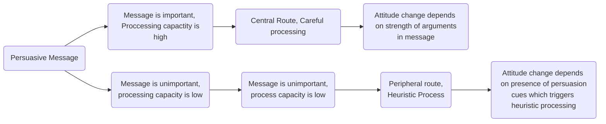

given by Richard E Petty and John T Cacioppo

uses both systematic and [[heuristics|heuristic]] models

```mermaid
flowchart LR
A(Persuasive Message)-->B(Message is important, </br> Proccessing capactity is high)
A-->C(Message is unimportant, </br>processing capacity is low)
B-->B1(Central Route, Careful processing)
B1-->B3(Attitude change depends </br> on strength of arguments in message)

C-->C1(Message is unimportant, </br> process capacity is low)
C1-->C2(Peripheral route, </br> Heuristic Process)
C2-->C3(Attitude change depends </br> on presence of persuasion cues which triggers heuristic processing)

```
