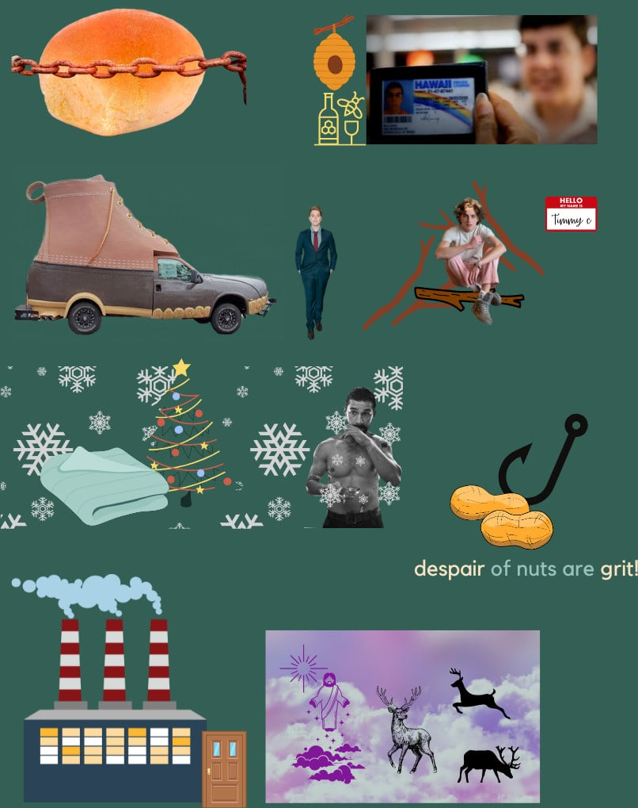

## Erikson's **Psychosocial** Theory
like Freud's theory, focuses on unconscious. But instead of sexual, focuses on social aspects 
connection, attribution, love, care

### Stages of Erikson's Theory
#### 1. Trust Vs Mistrust
shapes worldview 
age - 0-1 
negative outlook or positive outlook wrt the world around them

#### 2. Autonomy Vs Shame
1 year - 3 year
sense of self, independence

#### 3. Initiative Vs Guilt
age - 3-5 
either takes initiative and makes friends, or feels guilty 

#### 4. Industry Vs Inferiority
mastering of knowledge, intellectual skills 
negative outcome = sense of inferiority; incompetent; 
unproductive

#### 5. Identity Vs Identity Confusion (or Identity diffusion)
10 - 20 / adolescence
finding your self identity
who they are, where they're going in life, their values etc
	failure to answer these - they are confused, negatively affects
	esteem
	
#### 6. Intimacy Vs Isolation
Early adulthood, 20s - 30s
Developing intimate relationships
Forming healthy friendships
failure - social isolation

#### 7. Generativity Vs Stagnation
40s - 50s, middle adulthood 
Generativity = want to help younger generation
Stagnation = having done nothing to help the younger gen
#### 8. Integrity Vs Despair
60+, late adulthood
reflects on past; retrospective
was life spent well? satisfaction
doubt vs gloom, despair 
sad about and unsatisfied about the kind of life they lived 
close to death, how they react to aging and concept of
death???

### Mnemonic for Erikson's Psychosocial Stages
[[Peg Word Mnemonic]]
One is a bun,
Two is a shoe,
Three is a tree,
Four is a door,
Five is a hive,
Six is sticks,
Seven is heaven,
Eight is bait

mnemonic for the goals of each stage: 
**He Will Probably Come Fast, Literally Can't Wait!** 💦

visual aid for mnemonic -> 
Rusted Bun (tRust)
Shoe run over by Shane in his car (Sha(n)me vs autonomy)

