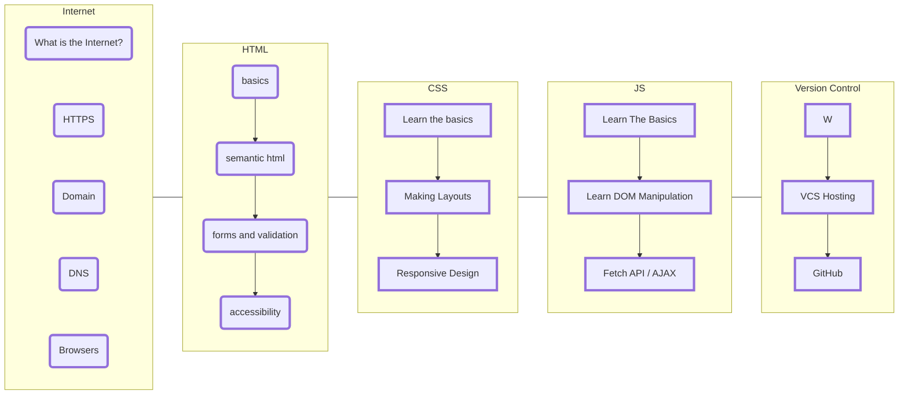

Adapted from https://roadmap.sh/frontend

```mermaid
flowchart LR

subgraph Internet
a(What is the Internet?)
b(HTTPS)
c(Domain)
x(DNS)
y(Browsers)
a~~~b~~~c~~~x~~~y
end

subgraph HTML
direction TB
d(basics)
e(semantic html)
f(forms and validation)
g(accessibility)
d-->e-->f-->g
end

subgraph CSS
direction TB
O[Learn the basics]
O --> P[Making Layouts]
P --> Q[Responsive Design]
end

subgraph JS
direction TB
S[Learn The Basics]
    S --> T[Learn DOM Manipulation]
    T --> U[Fetch API / AJAX]
end

subgraph vc [Version Control]
direction TB
 W --> X[VCS Hosting]
    X --> Y[GitHub]
end

Internet---HTML---CSS---JS---vc

classDef default stroke-width:4px;

```
