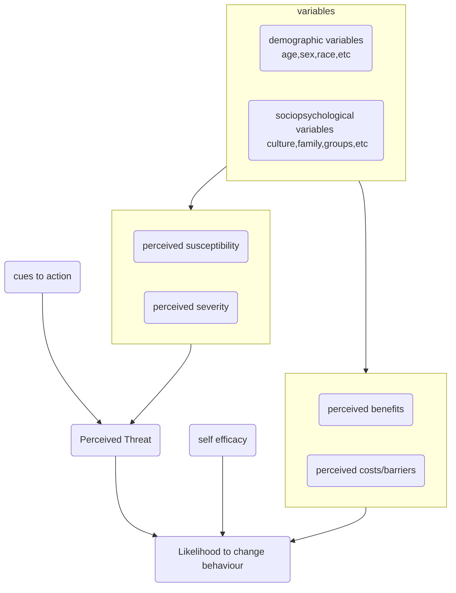

### Health Belief Model
Once we form a belief, there is an attitude, we start taking action
belief -> attitude -> actions 

researchers have found out that people do not respond well to health awareness programmes. they take it lightly. At the same time there are people who are very receptive to these, people who are very receptive to things like vaccinations and personal hygiene 

People's belief, attitude, and **perceived benefit** , value of self efficacy, 
mental blocks /barriers 

- Developed in 1950s by US Public Health Service to reduce barriers and understanding people to help better promote good health 
   
HBM, there are four critical points:  
- **severity** of a potential illness: The probability that a person will change their health behaviors to avoid a consequence depends on how serious they believe the consequences will be.

- person’s **susceptibility** to that illness: People will not change their health behaviors unless they believe that they are at risk.

- benefits of taking a **preventive action**

-  **barriers** (perceived costs) to taking that action: One of the major reasons people don't change their health behaviors is that they think doing so is going to be hard.

sub points
	1. self-efficacy 
	2. culture, gender, age
	3. modifying factor 

