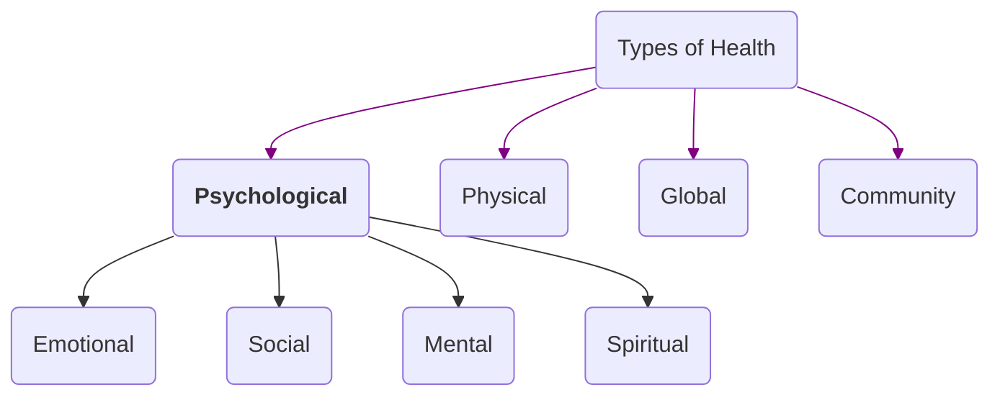

## Psychological
## Emotional
[[Emotional Intelligence]] 
[[Resilience]]
[[Self Concept - Development]]
8i
mn                                                              ## Physical
## Mental / Psychological
## Social
## Global
## Community

