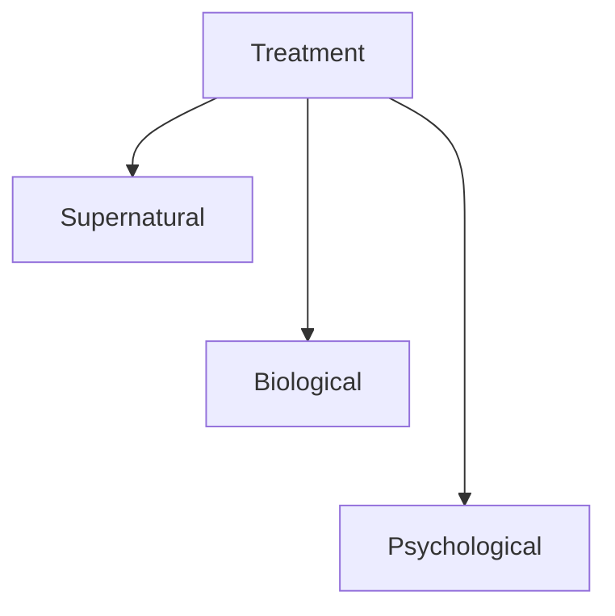
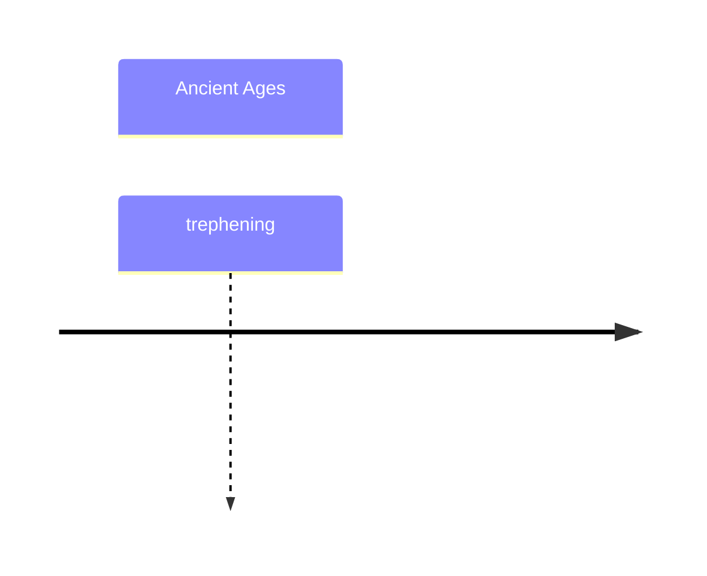

History
1. Stone Age cavemen - Trephening/Trepanning
2. Greek, Chinese, Egyptians, Hebrews : God / demon
3. Exorcism
4. Hippocrates identified three categories - Mania, Melancholia, Phrenitis
5. Hippocrates and Galen - Imbalance in humours - Sanguine (blood) Phlegmatic (plegm)  
    Choleric (yellow bile), Melancholic (Black bile)  
    Soln - veg diet, abstinence from excesses, exercise, calm and reg life  
    also studied dreams
6. Asylums / mad houses. Pinel changed from violent -> take care
7. Franz Auton Mesmer - Hypnosis
8. Emil Kraeplin - first diagnostic system
9. Freud - unresolved childhood issues in unconsc mem
10. BF Skinner, Watson - due to reward, punishment, conditioning

---

“possession”

Following is an extract from *Butcher, James Neal. Abnormal psychology. — 16th ed. / James N. Butcher, University of Minnesota, Jill M. Hooley, Harvard University, Susan Mineka, Northwestern University*

> ### Ancient Greco-Roman
> ⭐**Hippocrates** (460–377 b.c.)  Greek physician who believed that mental disease was the result of natural causes and brain pathology rather than demonology. 
> **Plato** (429–347 b.c.) A Greek philosopher who believed that mental patients should be treated humanely and should not be held responsible for their actions. 
> ⭐**Aristotle** (384–322 b.c.) A Greek philosopher and a pupil of Plato who believed in the Hippocratic theory that various agents, or humors, within the body, when imbalanced, were responsible for mental disorders. Aristotle rejected the notion of psychological factors as causes of mental disorders. 
> ⭐**Galen** (a.d. 130–200) A Greek physician who contributed much to our understanding of the nervous system. Galen divided the causes of mental disorders into physical and mental categories
> ### The Middle Ages 
> **Avicenna** (980–1037) An ancient Persian physician who promoted principles of humane treatment for the mentally disturbed at a time when Western approaches to mental illness were inhumane. 
> **Hildegard** (1098–1179) A remarkable woman, known as the “Sybil of the Rhine,” who used curative powers of natural objects for healing and wrote treatises about natural history and medicinal uses of plants. 
> ### The Sixteenth Through the Eighteenth Centuries 
> **Paracelsus** (1490–1541) A Swiss physician who rejected demonology as a cause of abnormal behavior. Paracelsus believed in psychic causes of mental illness. 
> **Teresa of Avila** (1515–1582) A Spanish nun, since canonized, who argued that mental disorder was an illness of the mind. 
> **Johann Weyer** (1515–1588) A German physician who argued against demonology and was ostracized by his peers and the Church for his progressive views. 
> **Robert Burton** (1576–1640) An Oxford scholar who wrote a classic, influential treatise on depression, The Anatomy of Melancholia, in 1621. 
> ⭐**William Tuke** (1732–1822) An English Quaker who established the York Retreat, where mental patients lived in humane surroundings. 
> ⭐**Philippe Pinel** (1745–1826) A French physician who pioneered the use of moral management in La Bicêtre and La Salpêtrière hospitals in France, where mental patients were treated in a humane way.
> **Benjamin Rush** (1745–1813) An American physician and the founder of American psychiatry, who used moral management, based on Pinel’s humanitarian methods, to treat the mentally disturbed. 
> ### The Nineteenth and Early Twentieth Centuries 
> **Dorothea Dix** (1802–1887) An American teacher who founded the mental hygiene movement in the United States, which focused on the physical well-being of mental patients in hospitals. 
> **Clifford Beers** (1876–1943) An American who campaigned to change public attitudes toward mental patients after his own experiences in mental institutions. 
> **Franz Anton Mesmer** (1734–1815) An Austrian physician who conducted early investigations into hypnosis as a medical treatment. 
> **Emil Kraepelin** (1856–1926) A German psychiatrist who developed the first diagnostic system. 
> **Sigmund Freud** (1856–1939) The founder of the school of psychological therapy known as psychoanalysis. 
> **Wilhelm Wundt** (1832–1920) A German scientist who established the first experimental psychology laboratory in 1879 and subsequently influenced the empirical study of abnormal behavior. 
> **Lightner Witmer** (1867–1956) An American psychologist who established the first psychological clinic in the United States, focusing on problems of mentally deficient children. He also founded the journal The Psychological Clinic in 1907. 
> **William Healy** (1869–1963) An American psychologist who established the Chicago Juvenile Psychopathic Institute and advanced the idea that mental illness was due to environmental, or sociocultural, factors. 
> **John B. Watson** (1878–1958) An American psychologist who conducted early research into learning principles and came to be known as the father of behaviourism. 
> **B. F. Skinner** (1904–1990) An American learning theorist who developed the school of learning known as operant conditioning and was influential in incorporating behavioural principles into influencing behavioural change

## Timeline

