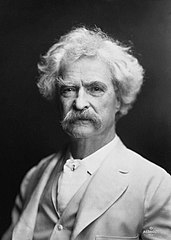

# Mark Twain

born Samuel Langhorne Clemens 

writer - satirist - one of the greatest American writers and the father of American literature 

known for using humor, wit, and realism to explore various aspects of American culture and society. 

critic of racism, imperialism, slavery, and hypocrisy

The Adventures of Tom Sawyer, Adventures of Huckleberry Finn, The Prince and The Pauper

imperialist -> more radical as time went by and became anti-imperialist

> I am said to be a revolutionist in my sympathies, by birth, by breeding and by principle. I am always on the side of the revolutionists, because there never was a revolution unless there were some oppressive and intolerable conditions against which to revolute

“came in with the comet” and as he predicted "went out with the comet” (referring to Halley's Comet)

---
wrote [[Advice to Youth]]

---
## Quotes

“Travel is fatal to prejudice, bigotry, and narrow-mindedness, and many of our people need it sorely on these accounts. Broad, wholesome, charitable views of men and things cannot be acquired by vegetating in one little corner of the earth all one's lifetime.”

“It liberates the vandal to travel — you never saw a bigoted, opinionated, stubborn, narrow-minded, self-conceited, almighty mean man in your life but he had stuck in one place since he was born and thought God made the world and dyspepsia and bile for his especial comfort and satisfaction.”

“I have a religion — but you will call it blasphemy,” he wrote in a letter in 1865. “It is that there is a God for the rich man but none for the poor … Perhaps your religion will sustain you, will feed you — I place no dependence in mine. Our religions are alike, though, in one respect — neither can make a man happy when he is out of luck.”

"Man is a Religious Animal. He is the only Religious Animal. He is the only animal that has the True Religion -- several of them. He is the only animal that loves his neighbor as himself and cuts his throat if his theology isn't straight."

