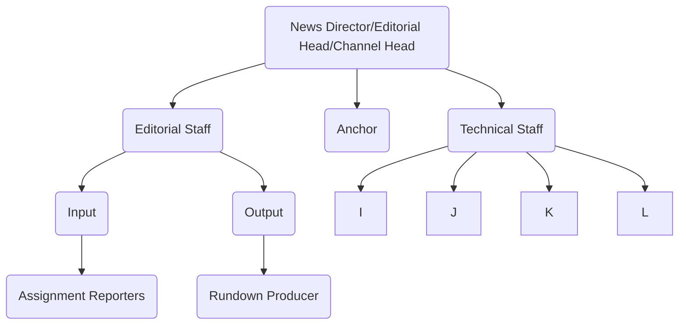
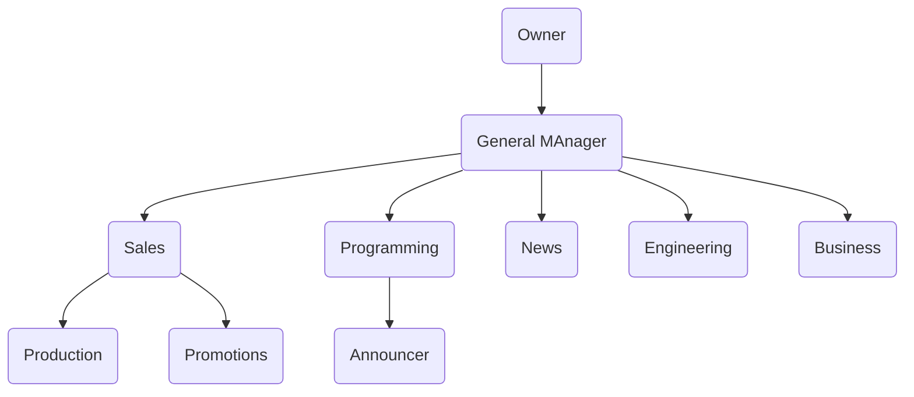

Structure in Print Media

![[Editorial Structure of Newsroom and Roles#Structure of Newsrooms]]

---
## Structure in Electronic Media

News Director / Editorial Head / Channel Head

Editorial Staff   Anchor     Technical Staff
Input Output                    Editor Graphics PCR MCR 
Assignment  Rundown Prod      on air off air  

PCR-->Panel Producer

off-air -> ticker/3D artist/2D artist

## Organizational Structure in Radio Station

Owner
General Manager
Sales Programming News Engineering Business
Production Promotions

Programming-->Announcer

Q) Why is there a need for media management in today's world? 
