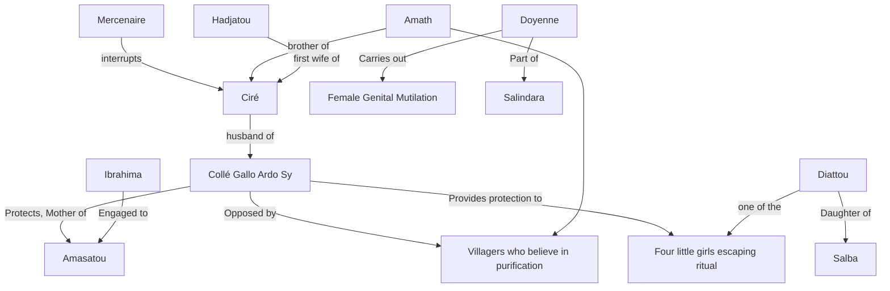

Director: Ousmane Sembène (Senegalese film director, producer and writer)
he "father" of African films and as one of the most prolific "French-speaking" African writers in this first century of "creative" writing in francophone Africa
## Characters
Collé
Mercenaire 
Amasatou
Ibrahima
Ciré Bathily
Amath Bathily
Diattou, Oumy, Awa, Nafi 
Salba
_Hadjatou_
Dougoutigui -> Village elder 

## Summary
set in a colourful Bambara village in Burkina Faso dotted with termite mounds, and a mosque made from clay

_bilakoro_

excision

>Men insist on purification, but it is really women who enforce it -- not just the fearsome women who actually conduct the ceremony, but ordinary women who have undergone it and see no reason their daughters should be spared.

salindara -> women who perform the FGM 

Burning of  radios -> parallel to book burning 

> whoever breaks that law
>will be killed by the moolaade

> Whoever crosses this rope
> will be punished by the moolaade.

>You have climbed over my head,
>I did not object,
>and now you want to shit on my head.

