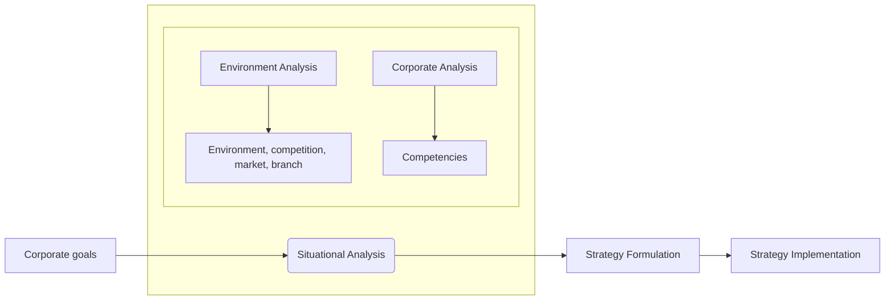
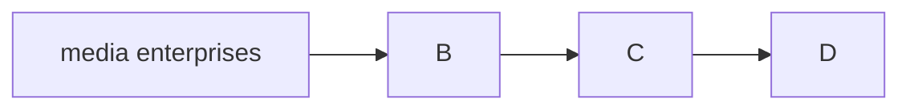

# Why Do We Need Media Management?

Media management is a discipline connected to business administration. It involves managing, organizing, and marketing media enterprises. 

Media management is responsible for most of the day-to-day functioning of a media enterprise. From **strategizing** to **advertising** to **organizing**, **maintaining**, and **running** the company. 

Media management involves managerial and administrative tasks that oversee the functioning of the enterprise. Some of these functions are:
structural organization
crisis management
Business administration
marketing of media
Keep track of sales / views

Media management takes care of all the post-production functions necessary. Media management is responsible for the content to be disseminated. It plays an important role in deciding how it is disseminated. It also can ask for editing of the media before it is shown to the world. 

There is no universal definition for media management. 
According to Wirtz, B. W.,  "*Media and internet management covers all the **goal-oriented activities of planning, organization and control** within the framework of the creation and distribution processes for information or entertainment content in media enterprises.*"

Media management is important as it is involved in the management of media enterprises. From the start to the end. The foundation, the administration, and distribution are all part of media management. Mass media is more important than ever, and is an ever-growing field. 

Enterprises are growing bigger, there are more and more consumers of media, and there is more content being distributed. Due to all of this, media management is absolutely essential to any media organization. 

*Not just companies, but governments and NGOs* also use the services of media management.  When the government wants to issue a PSA, wants to raise awareness, etc. 

Without media management, media as we know it today would not have existed. The depth and breadth of the field and its nature necessitates not only the existence of media management but also its constant evolution to adapt and keep up pace with the market and breakthroughs in technology. 

Example of media management in use: 
A social media firm needs media management to find out trends, the demographic, what kind of content gets more views. etc. Research and data science is involved in this. There will be market researches, surveys, polls, as well as tracking data and so on. If the firm posts something that has an adverse negative reaction, the media management has to handle the crisis in a way that the reputation of the company is intact. 

## Functions of Media Management 
### Strategic Management
situational analysis

Strategic management is the process of defining the vision, mission, goals, and objectives of the media organisation, and developing and implementing plans and policies to achieve them. 

Strategic management helps the media organisation to align its activities with its core values and purpose, to identify and respond to the opportunities and threats in the external environment, to leverage its strengths and overcome its weaknesses, and to create and sustain a competitive advantage in the market. For example, a media organisation may use strategic management to decide what kind of content to produce, what audience to target, what channels to use, what partnerships to form, and what innovations to pursue.

### [[Production Management]]
### [[Marketing]]
### Organizational Management

