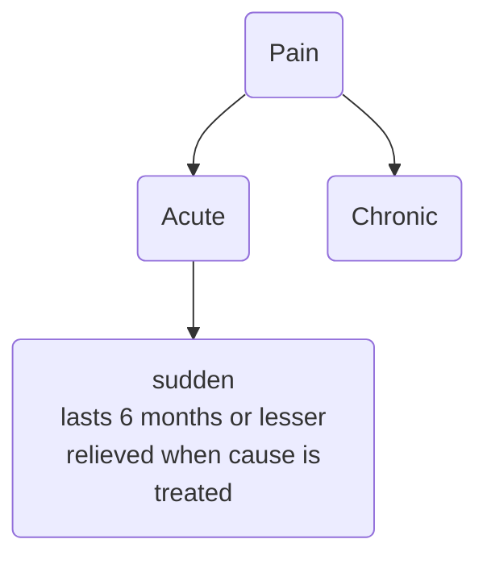

a complex, and subjective **sensory** and **emotional** experience that is associated with **actual** or **potential** **tissue damage**

it is a **signal** in our nervous systems that something is wrong
unpleasant feeling;

can be localized or generalized

causes discomfort and can even cause emotional distress

[[Perception of Pain]]

---
masochists ?? 
[[Emotional Pain]] or [[Psychological Pain]] -> Painkillers helps reduce these too! 

