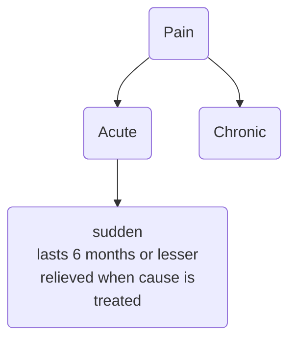

a complex, and subjective **sensory** and **emotional** experience that is associated with **actual** or **potential** **tissue damage**

it is a **signal** in our nervous systems that something is wrong
unpleasant feeling;

can be localized or generalized

## dimensions
has two dimensions - 
1. Sensory Dimension:
   - The sensory dimension of pain refers to the physical and physiological aspects of pain perception.
   - It encompasses the intensity, location, and quality of the pain. For example, pain can be described as sharp, burning, throbbing, or aching.
   - Sensory pain information is primarily processed in the brain through the **somatosensory cortex**, helping us identify the location and characteristics of pain.
2. Emotional Dimension:
   - The emotional dimension of pain involves the psychological and affective aspects of pain.
   - It includes the emotional responses and feelings associated with pain, such as fear, anxiety, depression, anger, and suffering.
   - The emotional dimension is often processed in brain regions associated with emotions, including the **limbic system** and the **prefrontal cortex**.
   - Psychological factors like stress, anxiety, and coping mechanisms can significantly influence the emotional dimension of pain.

causes discomfort and can even cause emotional distress

[[Perception of Pain]]

---
masochists ?? 
[[Emotional Pain]] or [[Psychological Pain]] -> Painkillers helps reduce these too! 

