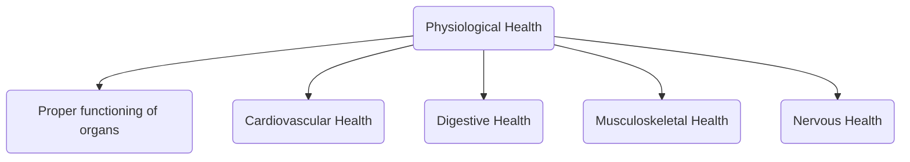

aka **Physical Health**

refers to overall wellbeing of body's physical systems and functioning of organs and tissues 

essential dimension in health 

crucial for an individual to lead a good life

