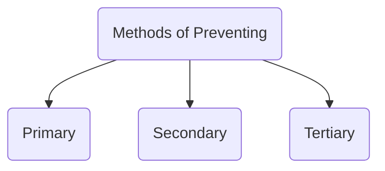

Predicting and explaining health behaviour is a complex task that involves understanding the **factors that influence** an individual's **choices** and **actions** in relation to their beliefs

### Methods of Preventing

#### Primary
to prevent the onset of illness or injury and promote overall health and wellbeing 

#### Secondary
focuses on **early detection** and intervention to halt or slow the progression

#### Tertiary

### Strategies Involved in These Methods
Primary Prevention
Health education

Secondary Prevention 
Screening and Early Diagnosis
Regular Health Check ups 
Case Finding
Prompt Treatment

Tertiaty Prevention
Rehab
Chronic Disease Management
Paliliative Care
Support Group and Counselling

## Awareness Campaigns
### Rural Areas
Community Health Workers
Local Language
Village Meetings and Camps
Visual Aids

### Urban Areas
Public Health Campaigns
School Programs
Corporate Health
Online (?inc)

