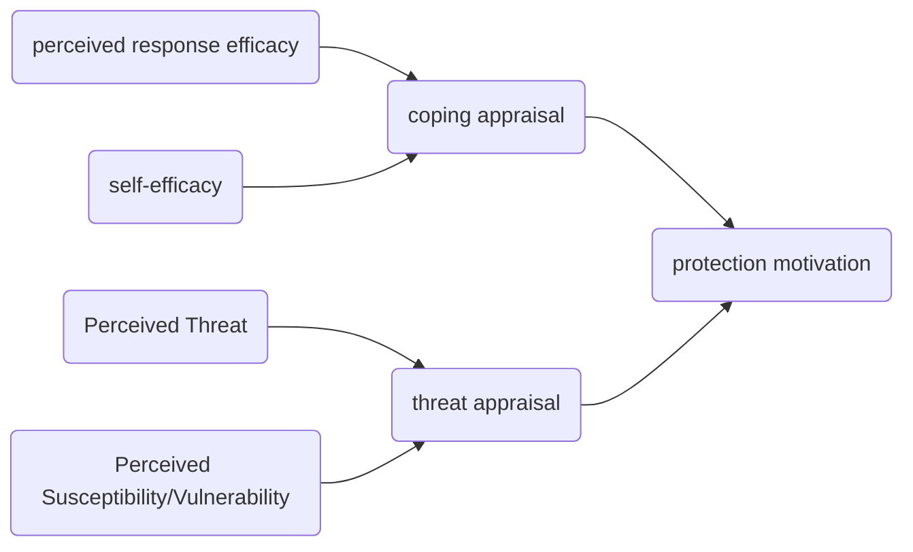

to understand individual human responses to fear appeals

proposes that people protect themselves based on two factors: 
1. threat appraisal 
2. coping appraisal

```mermaid
flowchart LR
pt(Perceived Threat)-->ta(threat appraisal)
ps(Perceived Susceptibility/Vulnerability)-->ta

pre(perceived response efficacy)-->ca(coping appraisal)
se(self-efficacy)-->ca

ca-->pm(protection motivation)
ta-->pm

```

