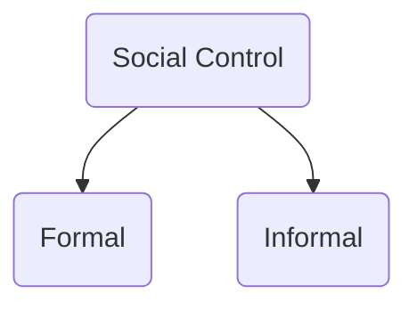

Social control is primarily of two types

Formal  
	authoritative body enforces it, usually the state
	**deliberate**, not spontaneous

Formal Means of Social Control
	- [[Law]]
	- Legislation
	- Courts
	- Bureaucracy
	- Armed Forces

Informal
	product of socialization, internalized values
	"spontaneously evolved" 

Informal Means of Social Control
	- Mores
	- Folkways
	- Religion
	- Customs
