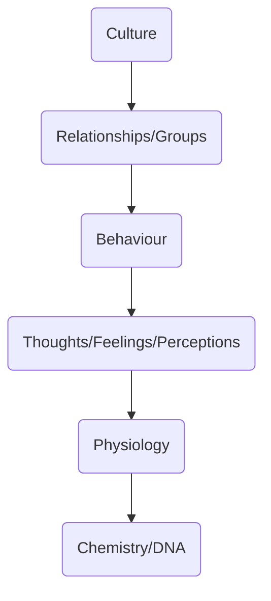

## Definition
**scientific study** that explains how the presence of others people, whether real, imaginary, or implied affects our thinking and behaviour - [[Gordon Allport]] 🔧!

How our behaviors, perceptions, thinking, etc change in the presence of other people. 

Both overt and covert behaviors.

Influence of other people on us and vice versa

## Social Structure
## Social Environment
## Social Interaction

### What Does it Study?
prejudice
group dynamics
	see also [[groups#change in behaviour]]
	
conformity
peer pressure

---

emerged after [[Existential]] and [[Humanistic]] [[../../../Schools of Psychology]]

## Concerned with
1) cognitive processes
how they are shaped
why people do what they do
how they react 

2) the environment 

## Historical Background of Social Psychology
late 19th century / early 20th century 
