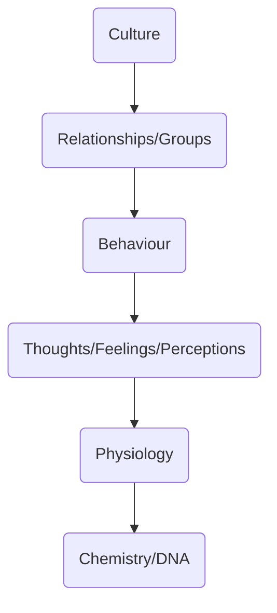

## Definition

scientific study of behavior and mental processes as they relate to how people interact with, or relate to, others.

>"*to understand and explain how the **thoughts**, **feelings**, and **behavior** of **individuals** are influenced by the actual, imagined, or implied the presence of other human beings.*"
>		-  [[Gordon Allport]]

How our behaviors, perceptions, thinking, etc change in the presence of other people. 
studies both overt and covert behaviors.
Influence of other people on us and vice versa

### Social Psychology vs Sociology
focuses on the individual, not society at large
social psychology is study of an **individual** in a **social context**
## Social Structure
## Social Environment
## Social Interaction

### What Does it Study?
prejudice
group dynamics
	see also [[groups#change in behaviour]]
	
conformity
peer pressure

---

emerged after [[Existential]] and [[Humanistic]] [[../../../Schools of Psychology]]

## Concerned with
1) cognitive processes
how they are shaped
why people do what they do
how they react 

2) the environment 

## Historical Background of Social Psychology
late 19th century / early 20th century 
