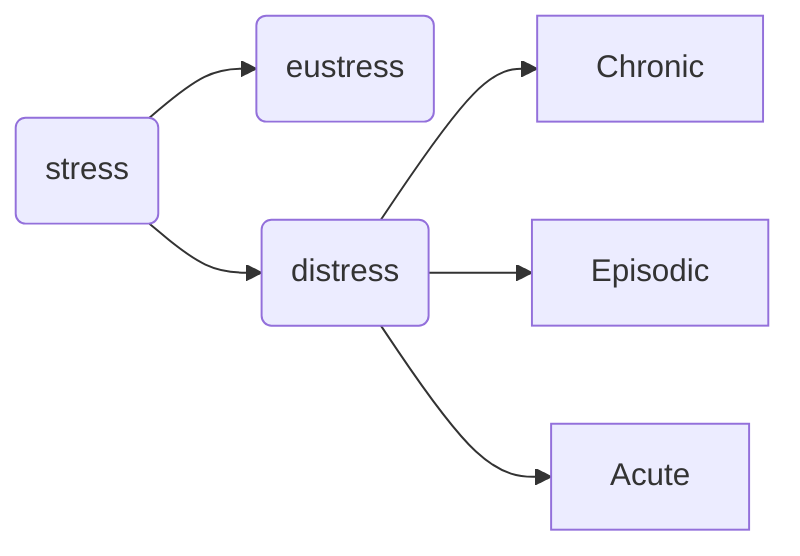

## Stress
discomfort 
can be physical, emotional, psychological **strain**
stress = **response of the body to anything that requires attention/action**

## Behavioural symptoms of psychological stress
- nervous habits
- social withdrawal
- increase in caffeine, alcohol, drug intake, etc (addiction)
- change in sleeping and eating patterns
- productivity falls

## Identifying Stress 
**Psychological** - concentrating, worrying, 
**Emotional** - 
**Physical**
**Behavioural**

## Types of Stresss

