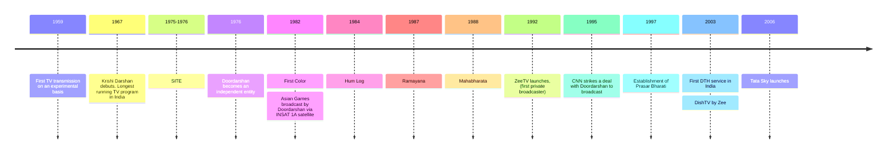

**1959** - TV in India on an experimental basis; All India Radio broadcasted for 2 hours every week
generally educational broadcasts for school children and farmers

**1975 - 1976** - **SITE** Satellite Instructional Television Experiment
collaboration between NASA and ISRO
aim to provide educational content to the masses, especially rural and remote areas
family planning, agriculture, literacy, health

**1967** : Krishi Darshan debuts. Longest running TV program in India

**1976** - Doordarshan which was part of AIR is now independent 

**1982** - First Colour TV broadcast in India; Asian Games broadcast by Doordarshan via INSAT 1A satellite

**Important shows**
1984 - Hum Log
1987 - Ramayana
1988 - Mahabharata

**1992** - ZeeTV launches, first private broadcaster
**1995** - CNN strikes a deal with Doordarshan to broadcast

**1997** - Establishment of Prasar Bharati

**2003** - First DTH service in India - DishTV by Zee
**2006** - Tata Sky launches

in 2022, the value of the TV industry in India was 709 billion rupees 