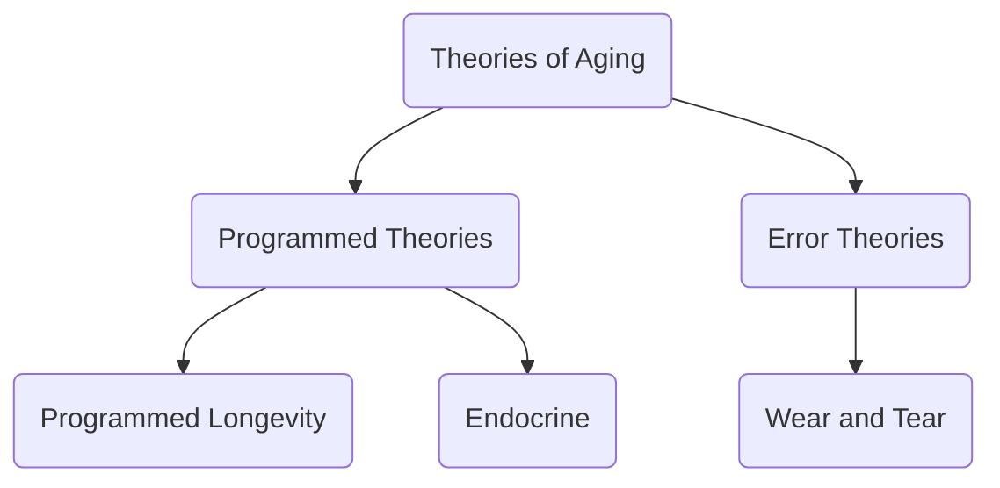

[[Midlife Crisis| <- midlife crisis]]

# Theories of [[Senescence|Aging]]

## Why would aging be programmed into our genes?
Factor of evolution; need to procreate

## Genetic Preprogramming theory of aging 
**[[Telomere]]** length reduces every time a cell divides
Telomere length = good marker of biological age

**built in time limit for reproduction of cells**

"*our longevity is primarily determined at the moment of conception and is largely reliant on our parents and their genes*" 

## Wear and tear theory of aging / Deterioration Theory / Fundamental Limitation Theory 
aging is caused by **progressive damage** to cells and body systems
with time and use, mechanical functions decline

## Disengagement Theory of Aging 

## Activity Theory of Aging

---
Jin K. (2010). Modern Biological Theories of Aging. _Aging and disease_, _1_(2), 72–74.

