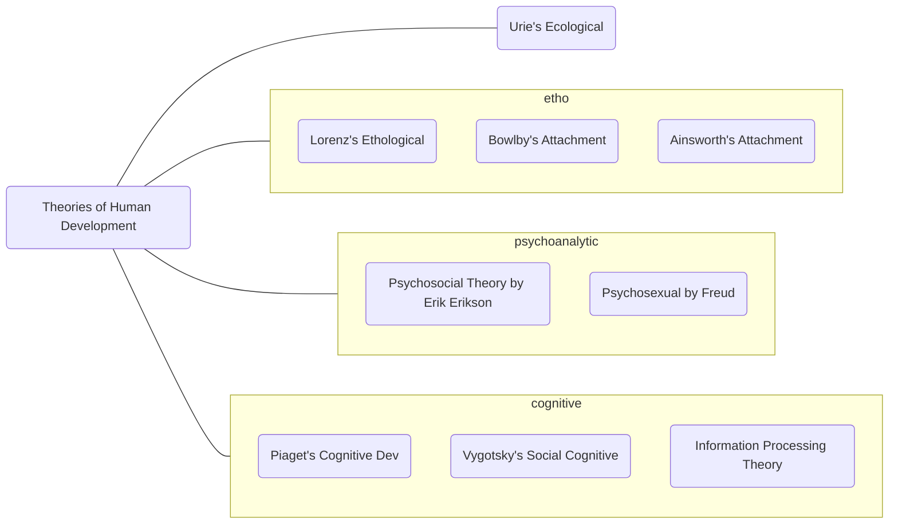

see also: [[Introduction to Life Span Development#Perspectives / Key issues in Lifespan Development|Key issues in Lifespan Development]]

# Psychoanalytic Theories
focuses on the influence of unconscious
symbolism
early experiences with parents extensively shape development

![[Psychosexual Theory by Freud]]

![[Erik Erikson's Psychosocial Stages]]

# Cognitive Theories

![[Piaget's Cognitive Theory of Development]]
   
![[Vygotsky's Sociocultural Cognitive Method]]

![[Information processing theory]]
   

![[Ethological Theory]]

![[Ecological Theory]]