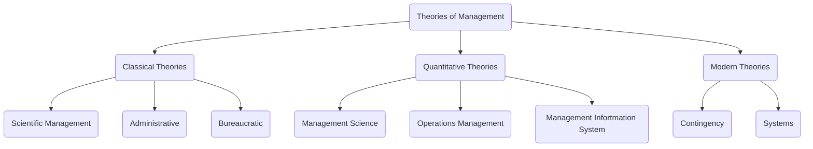

# Classical Theories

## Scientific Management
increasingly popular in the early 19th century
coordinating the enterprise for everyone's benefit including increased wages for laborers

>system devised by industrial engineers for the purpose of serving the common interests of employers, workmen and society at large through the elimination of avoidable wastes, the general improvement of the processes and methods of production, and the just and scientific distribution of the product.

bottom up view
### Proponents 
Frederick Winslow Taylor; the theory is also called Taylorism after him
### Emphasizes on
- Need for developing a **scientific way** of performing each job 
- Training and preparing workers to perform that particular job
- Establishing harmonious relations between management and workers so that job is performed in a desired way 
### Steps Involved:
1. Develop a science for each element of the job to replace old rule of methods
2. Scientifically select employees and train them to do the job as described
3. Supervise employees to make sure they follow the prescribed methods
4. Continue to plan the work but use workers to actually get the work done

### Two Managerial Processes
emerged from Taylor's approach to management

1) Piece Rate Incentive System
highest output gets rewarded

2) Time and Motion Study
jobs are broken down into various small tasks, timing each part and rearranging the parts into the most efficient method of working
time studies -> observe and record time taken to complete a task; determination of standard time (or acceptable time taken to complete a task to keep up with normal pace)
motion studies -> recording and observing the body language
### Limitations of Scientific Management
1. Technical point of view, engineering point of view NOT managerial point of view
2. Does not count the social aspects and needs; focuses on material acquisition only
3. Ignored human desire for job satisfaction. Workers are more likely to go on protests and strikes rendering scientific management ineffective

## Administrative Theory
focuses on principles that could be used by managers to coordinate the internal activities of organizations
top-down view

**Henri Fayol** - Father of Management 
he believed scientific forecasting and proper methods of management would lead to satisfactory results
believed by focusing on managerial practices he could minimize misunderstandings and increase efficiency in organizations
was the CEO of a mining company

***General and Industrial Management* -> work by Henri Fayol 

Accd to him, operations can be divided into six broad areas -
**Technical** - Producing and manufacturing
**Commercial** - Buying, selling, and exchange
**Financial** - Search for and optimal use of capital
**Security** - Protecting employees and property
**Accounting** - maintaining records of cost, profits, liabilities, balance sheets
**Managerial** - Planning, organizing, commending, coordinating and controlling.

believed in control and strict, treelike, command chain
### 14 Principles
Division of work
authority and responsibility
discipline
unity of command 
unity of direction 
subordination of individual interest to the general interest -> goal of company >>> individual interest
initiative - employees should be encouraged to give their inputs
Remuneration - fair pay based on factors like cost of living and productivity of employment
equity - everyone should be treated the same 
esprit de corps 

## Bureaucratic Management

by [[Max Weber]]
Weber observed a lot of nepotism which he found gross and unjust
>"a bureaucracy is a highly structured, formalized and impersonal organization. In other words, it is a formal organization structure with a set of rules and regulations"
> -- Max Weber 

## Behavioural Approach to Management
influenced by Hawthorne studies
focused on the **individual aspect**

[[Abraham Maslow]]'s hierarchy of needs 
# Quantitative Theories
emerged during WW2
## Management Science
emphasizes use of **mathematical models** and **statistical models** for decision making
aka operations research

**criticism** 
This approach has been criticized for its overemphasis on mathematical tools. Many managerial activities cannot be quantified because they involve human beings who are governed by many irrational elements as well.
## Operations Management
effective management of the production process and the timely delivery of an organization's products and services.
applied form of management science 
## Management Information System
focuses on designing and implementing computer-based information systems
for business organizations.
#

![[modern theories of management]]