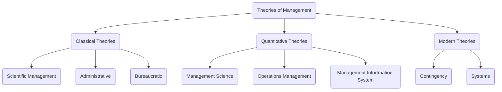

# Classical Theories

## Scientific Management

(?) people -

### Emphasizes on
- Need for developing a **scientific way** of performing each job 
- Training and preparing workers to perform that particular job
- Establishing harmonious relations between management and workers so that job is performed in a desired way 

### Steps Involved:
1. Develop a science for each element of the job to replace old rule of methods
2. Scientificially select employees and train them to do the job as described
3. Supervise employees to make sure they follow the prescribed methods
4. Continue to plan the work but use workers to actually get the work done

### Two Managerial Processes
emerged from Taylor's approach to management

1) Piece Rate Incentive System
highest output gets rewarded

2) Time and Motion Study
jobs are broken down into various small tasks and 

### Limitations of Scientific Management
1. Technical point of view, engineering point of view NOT managerial point of view
2. Does not count the social aspects and needs; focuses on 
3. Ignored human desire for job satisfaction. Workers are more likely to go on protests and strikes rendering scientific management ineffective

## Administrative Theory
focuses on principles that could be used by managers to coordinate the interal activities of organizations

**Henri Fayol** - Father of Management 
he believed scientific forecasting and proper methods of management would lead to satisfactory results

***General and Industrial Management* -> work by Henri Fayol 

Accd to him, operations can be divided into six broad areas -
**Technical** - Producing and manufacturing
**Commercial** - Buying, selling, and exchange
**Financial** - Search for and optimal use of capital
**Security** - 
**Accounting** - maintaining 
**Managerial** 

### 14 Principles
Division of work
authority and responsibility
discipline
unity of command 
unity of direction 
subordination of individual interest to the general interest
initiative

## Bureaucratic Management

# Quantitative Theories
## Management Science
## Operations Management
## Management Information System

#

![[modern theories of management]]