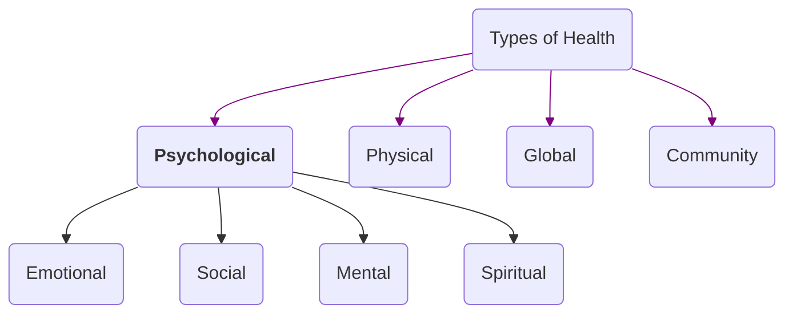

## Psychosocial / Psychosocial Health
Cognitive, emotional, social, and spiritual health 
mental wellbeing
### Emotional
[[Emotional Intelligence]] 
[[Resilience]]
[[Self Concept - Development]]
### Cognitive / Mental 
### Social
### Spiritual 

### factors affecting mental health
[[Coping Mechanisms]]
Emotional Regulation
Resilience
Self Esteem and Confidence
Work Life balance
Social Support

## Physical
## Global
health of the populations in the **worldwide** context
area of study trying to achieve equity in health all over the world
studies health issues that are **transnational**

worldwide health improvement
reduction of disparities
protection against global threats 

## Community
promoting and protecting the health and well-being of
a specific community or population.

focuses on understanding the health needs, behaviors, and risks of
a particular group of people living in a defined
geographical area or sharing common characteristics.
