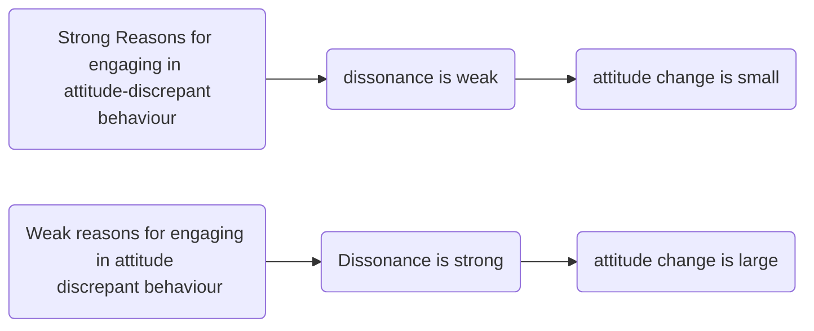

[[Festinger & Carlsmith (1959)]]

Small rewards for engaging in counter-attitudinal change > large rewards for engaging in the same

---
notes: 
but why? what's the inner, underlying mechanism?
was the experiment replicated?

---
see also:
[[Cognitive Dissonance]]
