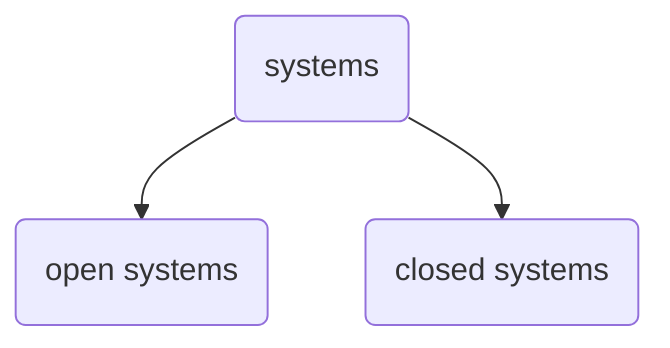

[[Theories of Management]]
# Modern Theories
## Systems Theory
Systems approach looks at 

4 major components -
1. Input
2. Transformational Process
3. Output
4. Feedback

Says there are two types of systems 

open systems - those that interact with its environment
closed systems - those that do NOT interact w its environment
## Contingency Theory
also called **situational theory**

it says there is *no one best way to manage all situations*

it was developed by managers, consultants, and researchers who tried to apply the concepts of the major schools for management through real life situations
*the task of managers is to identify which **technique** will in a particular
situation or under particular circumstances and at a particular time, best contribute to the attainment of management goals"* 

