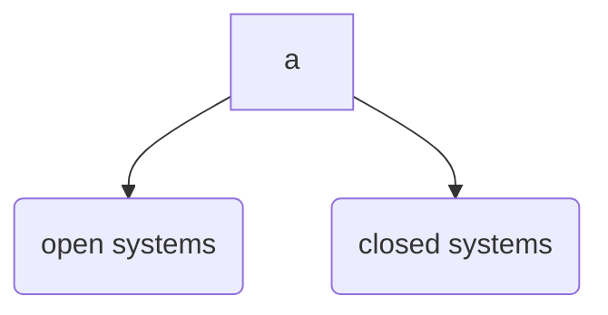

[[Theories of Management]]

# Modern Theories
## Systems Theory
Systems approach looks at 

4 major components -
1. Input
2. Transformational Process
3. Output
4. Feedback

## Contingency Theory
also called **situational theory**

it says there is *no one best way to manage all situations*

it was developed by managers, consultatants, and researchers who tried to apply the concepts of the major schools for management through real life situations

*the task of managers is to identify which **technique** will 

